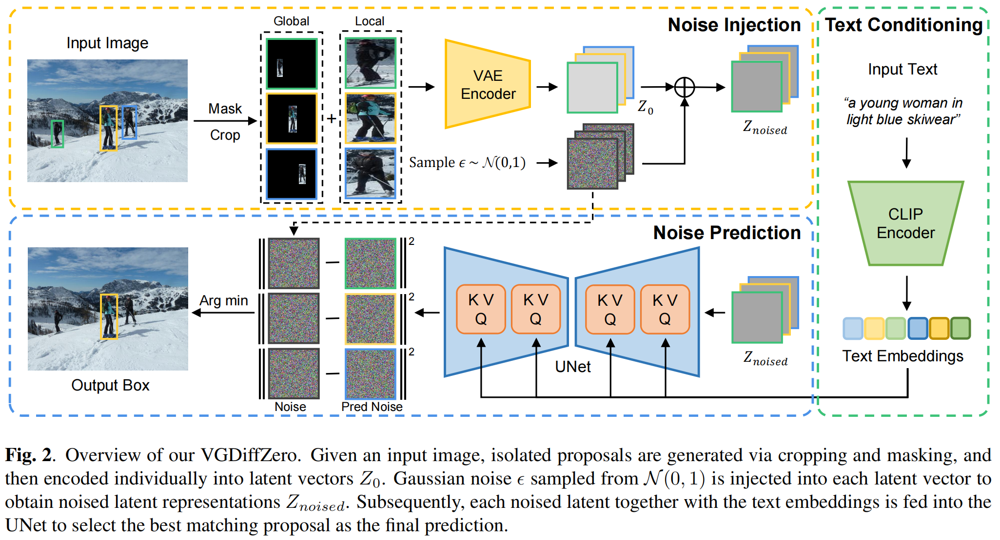

<div align=center>
  
# VGDiffZero: Text-to-image Diffusion Models Can Be Zero-shot Visual Grounders

**[Xuyang Liu](https://xuyang-liu16.github.io/), [Siteng Huang](https://kyonhuang.top/), [Yachen Kang](https://yachenkang.github.io/), [Honggang Chen](https://sites.google.com/view/honggangchen/), [Donglin Wang](https://milab.westlake.edu.cn/)**

<p>
<a href='https://arxiv.org/abs/2309.01141'></a>
<a href='https://ieeexplore.ieee.org/document/10445945'></a>
</p>

</div>


## :sparkles: Overview
<p align="center">  </p>

> **TLDR:** In this work, we explore directly applying a pre-trained generative diffusion model to the challenging discriminative task of visual grounding without any fine-tuning and additional training dataset.

## 💥 Core codes
VGDiffZero is initailized by [.diffusion/models.py](https://github.com/xuyang-liu16/VGDiffZero/blob/main/diffusion/models.py), and implemented by a `class VGDiffZeroExecutor`, which can be found in [executor.py](https://github.com/xuyang-liu16/VGDiffZero/blob/main/executor.py).


## :point_right: Installation 
Create a conda environment and activate with the following command:
```shell
# create conda env
conda env create -f environment.yml

# activate the environment
conda activate VGDiffZero
```
## :point_right: Dataset

### 1. Download COCO 2014 train images
Download images via this [link](http://images.cocodataset.org/zips/train2014.zip), and move them to `./data/`.

### 2. Download RefCOCO, RefCOCO+, and RefCOCOg annotations 
Download annotations from this [google drive link](https://drive.google.com/drive/folders/1OqbQ25xQh5HXxZLvoxLprS8w7gA54GkR?usp=drive_link), and move them to `./data/`.

## :point_right: Evaluation
```shell
python main.py --input_file INPUT_FILE --image_root IMAGE_ROOT --diffusion_model {1-4/2-1} --method {full_exp/core_exp/random} --box_representation_method {crop/mask/crop,mask} --box_method_aggregator {sum/max} {--output_file PATH_TO_OUTPUT_FILE} {--detector_file PATH_TO_DETECTION_FILE}
```
(`/` is used above to denote different options for a given argument.)

`--input_file`: the processed annotations in `.jsonl` format

`--image_root`: the top-level directory containing COCO 2014 train images

`--detector_file`:  if not specified, ground-truth proposals are used. For RefCOCO/g/+, the detection files should be in `{refcoco/refcocog/refcoco+}_dets_dict.json` format

Choices for `diffusion_model`: select different Stable Diffusion model versions. (default: "2-1")

Choices for `method`: "full_exp" is using the full expression as text input. "core_exp" is using core expression extracted by spaCy as text input, and "random" is randomly selecting a proposal as the prediction. (default: "full_exp")

Choices for `box_representation_method`: "crop" is using cropping only to isolate proposals. "mask" is using masking only to isolate proposals, and "crop,mask" is using both cropping and masking for comprehensive region-scoring. (default: "crop")

Choices for `box_method_aggregator`: given two sets of predicted errors, "sum" selects the proposal with the minimum total error $e_\text{total} = e_\text{mask} + e_\text{crop}$, while "max" selects the proposal with the minimum error in either set. (default: "sum")

## :thumbsup: Acknowledgements
Our implementation of VGDiffZero is partly based on the following codebases, including [Stable-Diffusion](https://github.com/CompVis/stable-diffusion), [Diffusion Classifier](https://github.com/diffusion-classifier/diffusion-classifier) and [ReCLIP](https://github.com/allenai/reclip). We gratefully thank the authors for their excellent works.

## :pushpin: Citation
Please consider citing our paper in your publications, if our findings help your research.
```bibtex
@inproceedings{liu2024vgdiffzero,
  title={VGDiffZero: Text-to-image diffusion models can be zero-shot visual grounders},
  author={Liu, Xuyang and Huang, Siteng and Kang, Yachen and Chen, Honggang and Wang, Donglin},
  booktitle={ICASSP 2024-2024 IEEE International Conference on Acoustics, Speech and Signal Processing (ICASSP)},
  pages={2765--2769},
  year={2024},
  organization={IEEE}
}
```

## :e-mail: Contact
For any question about our paper or code, please email `liuxuyang@stu.scu.edu.cn`.

