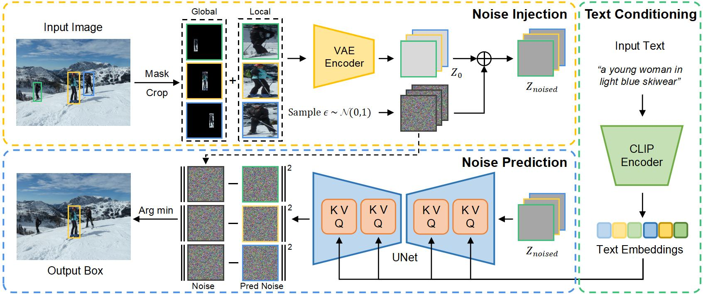

# VGDiffZero: Text-to-image Diffusion Models Can Be Zero-shot Visual Grounders
Official PyTorch implementation of our paper <br>
**VGDiffZero: Text-to-image Diffusion Models Can Be Zero-shot Visual Grounders** <br>
Westlake University and Sichuan University <br>
Xuyang Liu, Siteng Huang, Yachen Kang, Honggang chen, and Donglin Wang <br>
_Preprint, Sep 2023_ <br>

## Overview
<p align="center">  </p>

Given an input image, isolated proposals are generated via cropping and masking, and then encoded individually into latent vectors $Z_0$. Gaussian noise $\epsilon$ sampled from $\mathcal{N}(0, 1)$ is injected into each latent vector to obtain noised latent representations $Z_\text{noised}$. Subsequently, each noised latent together with the text embeddings is fed into the UNet to select the best matching proposal as the final prediction.

## Installation 
Create a conda environment and activate with the following command:
```shell
# create conda env
conda env create -f environment.yml

# activate the environment
conda activate VGDiffZero
```
## Dataset

### 1. Download COCO 2014 train images
Download images in "./data/" path
```shell
wget http://images.cocodataset.org/zips/train2014.zip
unzip train2014
```
### 2. Download RefCOCO, RefCOCO+, and RefCOCOg annotations 
Download annotations in "./data/" path

## Evaluation
```shell
python main.py --input_file INPUT_FILE --image_root IMAGE_ROOT --method {full_exp/core_exp/random} --box_representation_method {crop/mask/crop,mask} --box_method_aggregator {sum/max} {--output_file PATH_TO_OUTPUT_FILE}
```
(`/` is used above to denote different options for a given argument.)

`--input_file`: the processed annotations in `.jsonl` format

`--image_root`: the top-level directory containing COCO 2014 train images

`--detector_file`:  if not specified, ground-truth proposals are used. For RefCOCO/g/+, the detection files should be in `{refcoco/refcocog/refcoco+}_dets_dict.json` format

Choices for `diffusion_model`: select different Stable Diffusion model versions. (default: "2-1")

Choices for `method`: "full_exp" is using the full expression as text input. "core_exp" is using core expression extracted by spaCy as text input, and "random" is randomly selecting a proposal as the prediction. (default: "full_exp")

Choices for `box_representation_method`: "crop" is using cropping only to isolate proposals. "mask" is using masking only to isolate proposals, and "crop,mask" is using both cropping and masking for comprehensive region-scoring. (default: "crop")

Choices for `box_method_aggregator`: given two sets of predicted errors, "sum" selects the proposal with the minimum total error $e_\text{total} = e_\text{mask} + e_\text{crop}$, while "max" selects the proposal with the minimum error in either set. (default: "sum")


